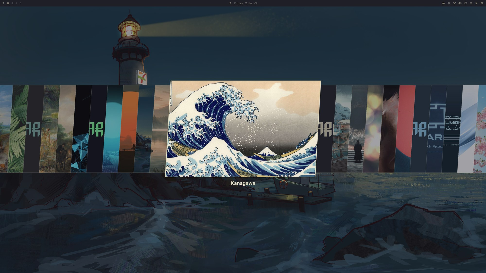

# Omapaper

Every wallpaper you own, in one picker.

Omarchy ships wallpapers separated by themes and only ever shows you the
handful belonging to the theme you are on.

Omapaper opens all of them at once — every theme's wallpapers plus your own —
in Omarchy's native picker, labelled by theme and searchable as you type.
And if you add new wallpapers to any theme folder, they Omapaper auto-loads them.



## Install

```bash
omarchy plugin add https://github.com/IuriAmauri/Omapaper.git --enable
```

## Remove

```bash
omarchy plugin remove omapaper
```

That disables the widget, drops it from the bar, and deletes the plugin. The
staging directory it builds is the one thing left behind:

```bash
rm -rf ~/.cache/omarchy/all-backgrounds
```

## Use

| Interaction | Action |
|---|---|
| Left click | Browse every theme's wallpapers |
| Right click | Next wallpaper |

### Filtering

The picker opens with a live filter — just start typing. It matches on the
label, so `nord` narrows to that theme, `moon` finds a wallpaper by name.

## Keyboard shortcut

`SUPER + CTRL + ALT + SPACE` opens the picker, set up for you on install. To
change it, edit **Keyboard shortcut** in Omapaper's widget settings, or set
`keybind` on the widget's entry in `~/.config/omarchy/shell.json`:

```json
{ "id": "omapaper", "keybind": "SUPER + F1" }
```

Set it to `""` to run with no shortcut at all.

Before binding, the plugin checks whether the
combination already belongs to something else, and if true, does nothing.
The binding is registered by the widget, so it only exists while Omapaper is
in your bar.

## How it works

`scripts/wallpapers` stages every theme's backgrounds as symlinks named
`<theme> <name>` under `~/.cache/omarchy/all-backgrounds`, then points the
stock Omarchy image picker at that one directory.

Uses Symlinks rather than hardlinks for compatibility.

## Requirements

Omarchy Quattro (plugin manifest `schemaVersion: 1`).

## License

MIT
